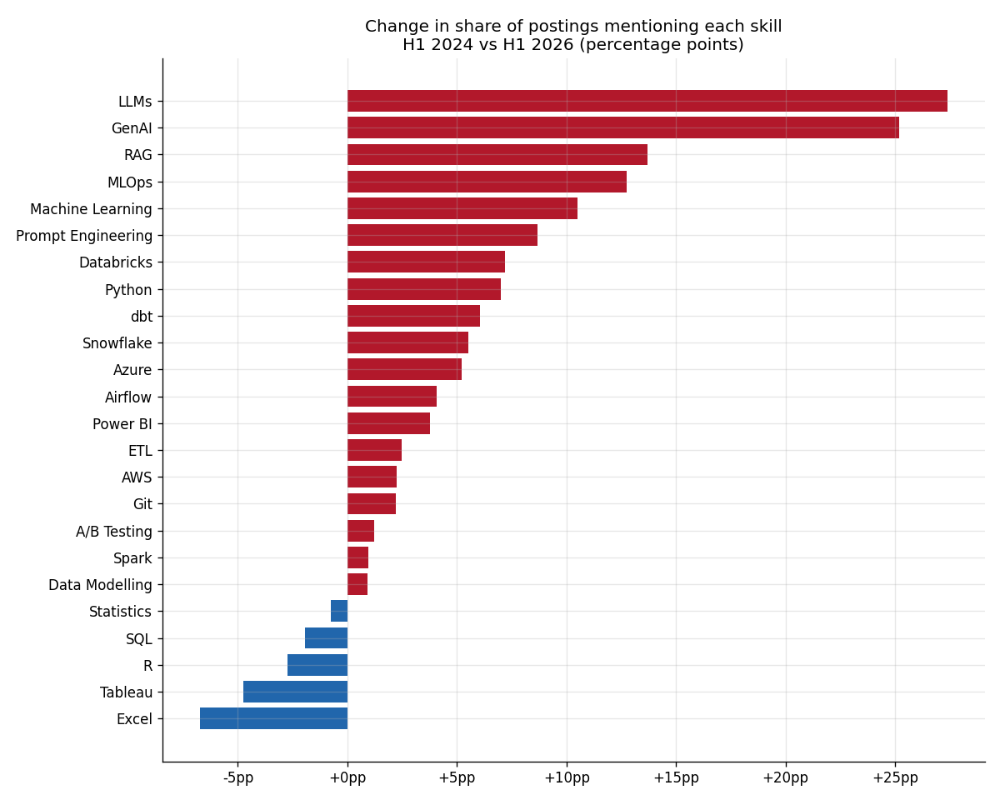

# The AI Hiring Boom - European Data Job Market Analytics

40,000 data and AI job postings across 8 European cities, January 2024 to
June 2026: which roles are growing, which skills are rising or fading, what
the jobs pay, and whether remote work is still on the table.

The pipeline: scraped-style raw postings → Python ETL (title
standardisation, salary parsing, skill extraction from description text) →
SQLite → SQL analysis → Jupyter EDA → Power BI dashboard.



## Headline findings

- AI Engineer postings roughly tripled over the period. Business Analyst
  was the only role family to shrink.
- LLMs, GenAI, RAG and prompt engineering went from near zero to a visible
  share of postings. Excel, Tableau and R lost ground.
- SQL is still the single most requested skill in the dataset. Some things
  don't change.
- AI/ML roles carry a clear salary premium, and it holds in every city.
- Advertised remote share fell quarter after quarter; hybrid is the default.

## The interesting engineering bits

**Text, not numbers, is the hard part.** The raw data looks like a job-board
scrape: 40+ title variants ("Sr. Data Analyst", "Data & Insights Analyst",
"BI & Reporting Analyst"...), salaries as free text ("€45,000 - €55,000 per
annum", "Up to €70,000", "£48,000 - £58,000", "Negotiable", or nothing at
all), and skills buried in description prose. The ETL:

- maps titles to 8 role families with ordered regex rules (most specific
  first, so "Machine Learning Engineer" doesn't land in "Data Engineer")
- parses salary strings to numeric min/max/mid in EUR, converting GBP,
  and tracks a `salary_disclosed` flag - only 62% of postings disclose,
  and every salary chart says so
- extracts 24 skills with word-boundary regexes (so "R" doesn't match
  every word containing the letter)

**Indexing matters.** The skill co-occurrence query self-joins a 249k-row
table. Without an index on `posting_id` it ran for minutes; with it, one
second. The ETL creates the indexes.

## Structure

```
ai-job-market-analytics/
├── data/raw/                    # scraped-format postings
├── data/processed/              # postings + long-format skills table
├── scripts/
│   ├── generate_data.py         # builds the simulated scrape
│   └── etl_pipeline.py          # parsing, cleaning, load to SQLite
├── analysis/
│   └── job_market_analysis.ipynb  # EDA: growth, skills, pay, remote
├── sql/analysis_queries.sql     # 11 queries incl. co-occurrence pairs
├── charts/                      # PNGs exported by the notebook
├── powerbi/dashboard_guide.md   # model, DAX, page layout
└── job_market.db
```

## Run it

```bash
pip install -r requirements.txt
python scripts/generate_data.py
python scripts/etl_pipeline.py
jupyter notebook analysis/job_market_analysis.ipynb
```

## Honest caveats

The data is simulated, modelled on the direction of published market
reports - so it demonstrates the method, not market truth. Salary
disclosure is 62% and probably biased (above-market payers advertise it
more). Skill extraction is keyword-based: "Pandas" doesn't count as
Python, and synonyms are missed. All three caveats would apply to a real
scrape too, which is rather the point.

## Stack

Python (pandas, numpy, matplotlib, regex) · Jupyter · SQLite · SQL · Power BI
